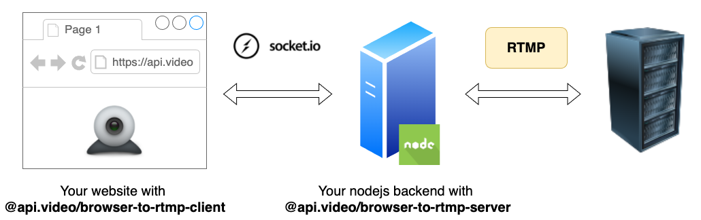

[](https://twitter.com/intent/follow?screen_name=api_video) &nbsp; [](https://github.com/apivideo/api.video-browser-to-rtmp) &nbsp; [](https://community.api.video)

<h1 align="center">api.video browser to RTMP</h1>

   


[api.video](https://api.video) is the video infrastructure for product builders. Lightning fast video APIs for integrating, scaling, and managing on-demand & low latency live streaming features in your app.

**WARNING: this project is still in beta version. Use it with care and do not hesitate to report any problem you may encounter.**

# Table of contents
- [Table of contents](#table-of-contents)
- [Project description](#project-description)
- [Getting started](#getting-started)
  - [Server-side part](#server-side-part)
  - [Client-side part](#client-side-part)
- [Documentation](#documentation)
  - [How it works](#how-it-works)
  - [The server part](#the-server-part)
    - [Instanciation](#instanciation)
    - [Options](#options)
      - [Overriding the livestream settings sent by the client](#overriding-the-livestream-settings-sent-by-the-client)
    - [Methods](#methods)
      - [`getConnections()`](#getconnections)
    - [Events](#events)
      - [`connection` event](#connection-event)
      - [`ffmpegOutput` event](#ffmpegoutput-event)
      - [`error` event](#error-event)
    - [Security considerations](#security-considerations)
  - [The client part](#the-client-part)
    - [Instanciation](#instanciation-1)
    - [Options](#options-1)
    - [Events](#events-1)
      - [`error` event](#error-event-1)
      - [`destroyed` event](#destroyed-event)
      - [`ffmpegOutput` event](#ffmpegoutput-event-1)
    - [Methods](#methods-1)
      - [`start()`](#start)
      - [`pause()`](#pause)
      - [`stop()`](#stop)
  
# Project description

This project aims to make easy streaming a video from your browser to a RTMP server. Any MediaSource can be used (webcam, screencast, …). 

The project is composed of three npm workspaces:
- [server](https://github.com/apivideo/api.video-browser-to-rtmp/tree/main/src/server) (npm package: **@api.video/browser-to-rtmp-server**): typescript package to include in a nodejs application that uses ffmpeg in order to stream to a RTMP server
- [client](https://github.com/apivideo/api.video-browser-to-rtmp/tree/main/src/client) (npm package: **@api.video/browser-to-rtmp-client**): JS library to include in a website that will stream a MediaSource to the server using socket.io
- [example](https://github.com/apivideo/api.video-browser-to-rtmp/tree/main/src/example): a very simple sample app to demonstrate how to use the server & the client


# Getting started

## Server-side part

First make sure that `ffmpeg`is properly installed on your server. 

Then add the dependancy to your nodejs project: 
```
npm install --save @api.video/browser-to-rtmp-server
```

You can finally instanciate the server:

```typescript
import http from 'http';
import BrowserToRtmpServer from '@api.video/browser-to-rtmp-server';

// ...


const server = http.createServer();
const browserToRtmpClient = new BrowserToRtmpServer(server, {
    cors: {
        origin: "*",
        methods: ["GET", "POST"],
        credentials: true
    }
});
server.listen(1234);

```

## Client-side part

```html
<html>
    <head>
        ...
        <script src="https://unpkg.com/@api.video/browser-to-rtmp-client" defer></script>
    </head>
    <body>
        <script>
            navigator.mediaDevices.getUserMedia({
                audio: true,
                video: true
            }).then((stream) => {
                const client = new BrowserToRtmpClient(stream, {
                    host: "localhost", 
                    rtmpUrl: "rtmp://0.0.0.0:1935/s/abcd", // RTMP endpoint
                    port: 1234
                });

                client.start();
            });
        </script>
    </body>
</html>
```


# Documentation

## How it works

Unfortunately, the browser cannot communicate directly with an RTMP server (due to network restrictions inherent in web browsers). 

To overcome this problem, we added a layer between the browser and the RTMP server. It is a nodejs server that has the task of transforming a websocket video stream from the browser to an RTMP stream. 

This mechanism is summarized in the following diagram:



## The server part

### Instanciation

The `BrowserToRtmpServer` constructor takes 2 parameters: 
- an instance of `http.Server` (the server that will handle the WebSocket connections)
- a `BrowserToRtmpServerOptions` (an object that contains the options of the instance to create)

Leaving it up to the developer to provide an http server provides great flexibility. You can for example decide to use https instead of http with a code like this:

```typescript
import fs from "fs";
import https from "https";
import BrowserToRtmpServer from '@api.video/browser-to-rtmp-server';

const httpsServer = https.createServer({
  key: fs.readFileSync("/tmp/key.pem"),
  cert: fs.readFileSync("/tmp/cert.pem")
});
const options  = { /* ... */ }; // BrowserToRtmpServerOptions
const browserToRtmpServer = new BrowserToRtmpServer(httpsServer, options);

httpsServer.listen(3000);
```

### Options 

The BrowserToRtmpServerOptions has the following attributes:

```typescript
{
  serverLogs?: {
    minLevel?: 'silly' | 'trace' | 'debug' | 'info' | 'warn' | 'error' | 'fatal'; // log level (default: info)
  }
  clientLogs?: {
    sendErrorDetails?: boolean,  // weither detailed error messages should be sent to the client or not (default: false) 
    sendFfmpegOutput?: boolean,  // weither ffmpeg output should be sent to the client or not (default: false) 
  }
  maxFfmpegInstances?: number;   // the maximum number of ffmpeg instances that can be run in parallel (if this limit is reached, connections will be refused) (default: empty, ie no limit)
  rtmpUrlRegexp?: RegExp;        // the template of allowed rtmp endpoints, in the form of a regular expression (example: /https:\/\/rtmp:\/\/broadcast.api.video\/s\/.*/, default: empty)
  socketio?: Partial<ServerOptions>,  // socket.io options (see https://socket.io/docs/v4/server-options/)
  hooks?: {
    // a function that will be called each time a client starts a livestream, can be use to override the livestream settings sent by the client (see bellow)
    start?: (socket: Socket<ClientToServerEvents, ServerToClientEvents, InterServerEvents, SocketData>, event: FfmpegConfig) => FfmpegConfig;
  }
}
```

#### Overriding the livestream settings sent by the client

All settings sent from the client when starting the livestream can be overwritten server-side using the `hooks.start` hook. For instance, the client can omit prividing the RTMP endpoint, leaving the server part filling it:

```typescript
const browserToRtmpServer = new BrowserToRtmpServer(server, {
  // ...
  hooks: {
    start: (socket, config) => {
      // for instance, you can here access the socket associated to the current request:
      // const token = socket.handshake.auth.token; // retrieve the auth token
      // ...
      const rtmpEndpoint = "rtmp://0.0.0.0:1234/s/abcd" // you can generate here the RTMP endpoint url according to your need:
      return {
        ...config,
        rtmp: rtmpEndpoint
      }
    }
  }
});
```

### Methods

#### `getConnections()`

Retrieve the list of all active connections. It returns a list of `ConnectionStatus`:

```typescript
{
  uuid: string;          // unique identifier for the connection
  remoteAddress: string; // remote ip address
  ffmpeg?: {            // details about the ffmpeg instance associated to the connection (can be undefined if ffmpeg is not yet running or if it has stopped)
    status: 'RUNNING' | 'ENDED' | 'ENDING' | 'CREATED'; // ffmpeg status
    framesSent: number;         // number of frame that has been sent to the RTMP server
    lastFrameSentTime?: number; // timestamp of the last sent frame
    pid?: number;               // pid of the ffmpeg process
    options: {                  // options that has been used to start ffmpeg
        framerate?: number;
        audioSampleRate?: number;
        rtmp?: string;
        audioBitsPerSecond?: number;
        videoBitsPerSecond?: number;
    }
  }
}
```

### Events

You can listen to events that emitted are by using the `on(eventName: string)` method.

#### `connection` event

The `connection` event is sent each time a new connection arrives. It contains the connection status associated to the connection. 


Example:
```typescript
browserToRtmpServer.on("connection", (c) => {
    console.log(`New connection uuid: ${c.uuid}`);
});
```

#### `ffmpegOutput` event

This event is sent each time one of the ffmpeg instances write something to its output stream.  It contains the uuid of the connection and the output message itself.


Example:
```typescript
browserToRtmpServer.on("ffmpegOutput", (uuid, message) => {
    console.log(`Ffmpeg output for connection ${uuid}: ${message}`);
});
```

#### `error` event

This event is sent each time a error occurs for a given connection.  It contains the uuid of the connection and the error.


Example:
```typescript
browserToRtmpServer.on("error", (uuid, error) => {
    console.log(`Error for connection ${uuid}: ${message}`);
});
```

### Security considerations

- We strongly recommend that you use https rather than http when instantiating the http server provided to the BrowserToRtmpServer
- You should always pay attention to the RTMP termination url when it is sent from the client. Use `rtmpUrlRegexp`, or generate the url from the server with the start hook, as explained before.

## The client part


### Instanciation

The `BrowserToRtmpServer` constructor takes 2 parameters: 
- a MediaStream (you get it using `navigator.mediaDevices.getDisplayMedia()` or `navigator.mediaDevices.getUserMedia()`)
- a `BrowserToRtmpClientOptions` (an object that contains the options of the instance to create)


### Options 

The BrowserToRtmpClientOptions has the following attributes:

```typescript
type BrowserToRtmpClientOptions = {
    host: string;   // host of the server where your BrowserToRtmpServer is waiting for connections
    port?: number;  // the port associated to the server (default: 8086)
    framerate?: number;          // the framerate (default: 25)
    rtmp?: string;               // the RTMP endpoint url (if not providded, it has to be set server-side)
    audioBitsPerSecond?: number; // audio bits per second (default: 128000)
    videoBitsPerSecond?: number; // video bits per second (default: 2500000)
    audioSampleRate?: number;    // the sample rate for audio (default: audioBitsPerSecond / 4)
    socketio?: Partial<ManagerOptions & SocketOptions>; // socket.io client options (see https://socket.io/docs/v4/client-options/)
}
```

### Events

You can listen to events that emitted are by using the `on(eventName: string)` method.

#### `error` event

The `error` event is sent each time an error occured. It contains the error itself.

Example:
```typescript
browserToRtmpClient.on("error", (error) => {
    console.log(`An error occured: ${error}`);
});
```

#### `destroyed` event

The `destroyed` event is sent when the ffmpeg instance associated to the connection is destroyed.

Example:
```typescript
browserToRtmpClient.on("destroyed", (error) => {
    console.log(`Instance destroyed`);
});
```

#### `ffmpegOutput` event

This event is sent each time the ffmpeg instance write something to its output stream. The event is sent only if the `clientLogs.sendFfmpegOutput` param is true on the server side.


Example:
```typescript
browserToRtmpClient.on("ffmpegOutput", (message) => {
    console.log(`Ffmpeg output: ${message}`);
});
```


### Methods

#### `start()`

Start the stream.

#### `pause()`

Pause the stream.

#### `stop()`

Stop the stream.
